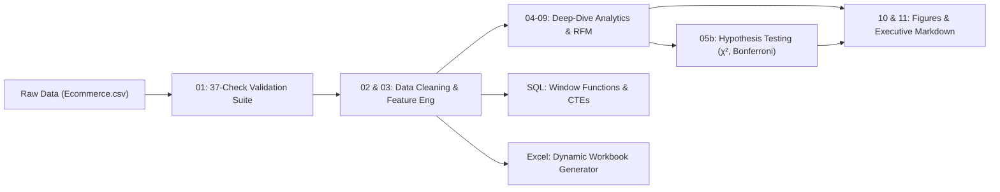

# 📊 E-Commerce Funnel Analytics & Revenue Optimization

An end-to-end e-commerce analytics portfolio project spanning **data auditing, cleaning, feature engineering, statistical hypothesis testing, cohort & RFM segmentation, SQL querying, automated reporting, and Excel dashboarding**.

> **Note on the data:** this is a public/Kaggle session-log dataset. Several signals — near-zero correlations across most fields, a uniform unit-price distribution, and a discount level that's statistically unrelated to every other variable in the data (see *Statistically Significant Drivers* below) — suggest it may be synthetically generated rather than real shopper behavior. It's treated here as a sandbox for building and validating a full analytics pipeline: the findings describe patterns in *this dataset*, and every one of them is backed by a test, not just an eyeballed chart.

---

## 🎯 Executive Summary & The "Why"

Operational e-commerce systems generate vast volumes of raw interaction logs. However, **raw operational data inherently suffers from incompleteness and false signals**:
- Categorical attributes are logged as cryptic integer codes without semantic labels.
- Satisfaction scores frequently carry synthetic defaults (e.g., non-purchasing visitors defaulting to a 4-star review).
- Marketing spend and promotional discounting are often distributed without verifying whether price cuts drive incremental conversion or simply cannibalize revenue.

**This project exists to resolve that incompleteness:** taking 25,000 raw, unverified session logs and transforming them into an audited, statistically tested commercial analytics engine — one that separates real signal from noise instead of asserting it.

---

## 📈 Key Business Outcomes & Findings

| Business Metric | Value | Strategic Takeaway |
| :--- | :--- | :--- |
| **Total Sessions Analyzed** | **25,000** | Full-year session-grain activity (2024-01-01 to 2024-12-30). |
| **Gross / Net Revenue** | **$11.11M / $10.12M** | **$991.6K** in promotional discounts granted (8.93% of gross revenue). |
| **Conversion Rate (CR)** | **22.46%** | 5,616 purchased sessions out of 25,000 total visits. |
| **Cart Abandonment Rate** | **65.15%** | Primary funnel leak is between cart addition and final checkout. |
| **Average Order Value (AOV)** | **$1,801.31** | Average items per order: 2.50. |
| **Discount vs. Conversion** | **No measurable lift (p = 0.64)** | 11–20% discount band conversion (22.74%) vs. 0% discount (22.43%) — a 0.31-point gap, 95% CI [-1.01, +1.63] — is statistically indistinguishable from noise. AOV still falls from $1,992 to $1,624, but that's arithmetic: gross order value is *flat* across bands (~$1,900–2,000 throughout), so the drop is the discount itself, not a shift toward cheaper products. |
| **Pareto Concentration** | **Top 20% products = 35.75% of revenue** | 180 of 898 purchased products (20.0%) generate 35.75% of net revenue; reaching 80% of revenue takes 549 products (61%). At the category level, "top 20%" rounds up to 2 of 8 categories (25% of the catalog), which hold 39.23% of revenue — the classic 80/20 pattern is present but weaker than the headline number suggests. |
| **Repeat Purchase Rate** | **27.75%** | 1,159 repeat purchasers out of 4,176 buyers (72.25% bought exactly once); top-10 customers account for 1.25% of revenue. (Single-year session data — a repeat-purchase rate, not a cohort-based retention metric.) |
| **Top Acquisition Channel** | **Channel 5 ($1.82M)** | Highest net revenue and conversion rate (23.60%) of the six channels — but channel is **not** a statistically significant driver of conversion overall (χ² p = 0.34, see below). Don't over-read the ranking. |

### ✅ Statistically Significant Drivers (Bonferroni-Corrected)

Scanning 13 candidate drivers of conversion with a chi-square test (α = 0.05/13 ≈ 0.0038, to control for testing that many things at once), only **two** survive correction:

| Variable | p-value | Significant? |
| :--- | :--- | :--- |
| **User type** | 1.0 × 10⁻⁴⁰ | ✅ Yes |
| **Session length (quartile)** | 1.5 × 10⁻⁵ | ✅ Yes |
| Product category | 0.015 | ❌ No |
| Price band | 0.049 | ❌ No |
| Payment method, channel, weekday, season, device, pages viewed, quantity, location, discount band | all p > 0.26 | ❌ No |

**The real story:** unlabeled "User Type 1" sessions convert at 25.65% vs. 18.55% for "User Type 0" — a 7.10-point gap (95% CI [6.07, 8.12]). Both types add to cart at nearly the same rate (64.7% vs. 64.3%), so the entire gap sits at **checkout**: cart-to-purchase conversion is 39.9% vs. 28.7%. Because 5,083 of 8,442 customers appear as *both* types across different sessions, `user_type` is a session-level attribute, not a customer trait — reported here as "Type 0/1 sessions," not as a guessed customer segment.

---

## 🔬 Project Architecture & Pipeline

### Script Execution Flow
1. **`python/01_data_validation.py`**: Executes a 37-point programmatic audit checking primary key uniqueness, funnel consistency (`purchased ⇒ added_to_cart`), formula integrity, date sequencing, and non-purchaser review defaults.
2. **`python/02_data_cleaning.py`**: Cleans and types data, creates consistent date representations, and exports validated baseline records.
3. **`python/03_feature_engineering.py`**: Derives behavioral stage indicators, gross revenue, discount flags, seasonality tags, and standardized labels.
4. **`python/04_exploratory_analysis.py`** & **`05_statistical_analysis.py`**: Computes parametric & non-parametric metrics (skewness, kurtosis, IQR) on commercial variables.
5. **`python/05b_hypothesis_tests.py`**: Chi-square tests (Bonferroni-corrected across 13 candidate drivers) and Wilson 95% confidence intervals to separate real conversion differences from noise; also tests whether discount level is associated with price, category, channel, or anything else (it isn't — discounts look randomly assigned).
6. **`python/06_sales_analysis.py`** & **`07_product_analysis.py`**: Calculates monthly run-rates, channel conversion, and product/category Pareto cumulative distributions.
7. **`python/08_customer_analysis.py`**: Builds an **RFM (Recency, Frequency, Monetary)** model segmenting 4,176 buyers into 5 lifecycle clusters: *Champions, At-Risk Loyalists, Core, Hibernating, and New/Low-Frequency*. Frequency is scored on fixed bins (1 / 2 / 3+ purchases) rather than a relative quintile, since 72% of buyers bought exactly once — a repeat-buyer segment can never contain a one-time buyer (enforced with an assertion).
8. **`python/09_time_series_analysis.py`**: Evaluates 7-day rolling revenue averages and quarter-over-quarter momentum (peak Q3: $2.62M).
9. **`python/10_visualization.py`** & **`11_report_automation.py`**: Generates 14 Matplotlib figures and automated Markdown executive summaries.
10. **`excel/build_excel_woorkbook.py`**: Programmatically generates a formatted multi-sheet Excel workbook with live formulas (`SUMIFS`, `COUNTIFS`, `XLOOKUP`), conditional formatting, and native charts.

---

## ✅ Reproducibility & Validation

Every number in this README is checked two ways that don't depend on each other or on this pipeline being "right":

- **`verify.py`** — recomputes the headline totals, top products, the category-revenue filter, the price-band grouping, and the RFM segment integrity independently in pandas *and* in SQL, and asserts they agree. Run it yourself: `python verify.py`.
- **`EXCEL_VERIFICATION_CHECKLIST.md`** — the same checks again using only Excel formulas and pivot tables on the cleaned CSV, with no Python or SQL involved at all, as a fully independent cross-check.

See **`CHANGELOG.md`** for the specific bugs this caught (a rounding bug that flattened every conversion rate to a whole percentage point, an unfiltered `gross_revenue` sum, a `HAVING` clause that filtered nothing, a multi-category product join, and a SQLite `GROUP BY`-on-alias bug that silently split one price band into two).

---

## 🔍 The "Weak Spots" & Roadmap (Where We Work More)

A vital dimension of this project is acknowledging its analytical boundaries and defining the engineering roadmap to resolve remaining incompleteness:

1. **Unlabeled Categorical Dimensions:**
   - *Limitation:* Channels, categories, devices, payment methods, and `user_type` — the single strongest driver found in this project — are encoded as integers without an enterprise codebook.
   - *Solution / Next Step:* Integrate with enterprise Master Data Management (MDM) / product taxonomy APIs rather than assuming arbitrary business labels.
2. **Product Taxonomy Inconsistencies:**
   - *Limitation:* Validation flagged 899 products mapped to multiple categories across different sessions (up to 8 categories per product).
   - *Solution / Next Step:* Implement primary category vs. auxiliary tag schemas upstream in the relational catalog. (The SQL layer now resolves this by assigning each product a *primary* category — the one it earned the most revenue in — see `05_subqueries.sql`.)
3. **Session Granularity vs. Multi-Item Baskets:**
   - *Limitation:* Data is logged at the session grain (one product per visit, quantity 1–4). It does not capture multi-item shopping baskets.
   - *Solution / Next Step:* Ingest true multi-line transaction logs to perform **Market Basket Analysis (Apriori / Association Rule Mining)** for cross-sell recommendations.
4. **Observational Association vs. Causal Pricing:**
   - *Limitation:* Even with the discount-conversion link now formally tested and found non-significant (p = 0.64), this remains an observational comparison, prone to customer self-selection bias.
   - *Solution / Next Step:* Run controlled **A/B Experiments** across promotional campaigns to establish true causal price elasticity curves.
5. **Modern Data Stack Migration:**
   - *Limitation:* Pipeline executes via local batch scripts.
   - *Solution / Next Step:* Transition transformations into **dbt**, orchestrate via **Airflow / Prefect**, and store in **Snowflake / BigQuery** for live BI consumption in Power BI / Tableau.

---

## 🛠️ Technology Stack
- **Languages & Libraries:** Python (Pandas, NumPy, SciPy, Matplotlib, OpenPyXL), SQL (SQLite, CTEs, Window Functions)
- **Techniques:** Data Quality Auditing, Statistical Hypothesis Testing (chi-square, Bonferroni correction, Wilson confidence intervals, two-proportion z-tests), RFM Segmentation (fixed-bin frequency scoring), Pareto Distribution (80/20 Rule), Funnel Diagnostics, Rolling Time-Series
- **Outputs:** Automated Excel Workbook (live `SUMIFS`/`COUNTIFS`/`XLOOKUP` formulas, conditional formatting, native charts), Automated Executive Markdown, 14 Matplotlib Visualizations, Comprehensive Data Quality Documentation, independent pandas/SQL/Excel reconciliation