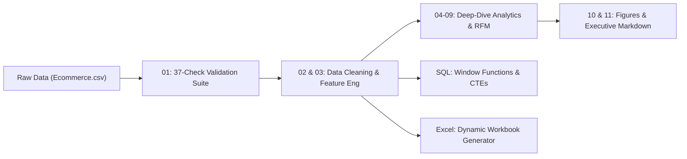

# 📊 E-Commerce Funnel Analytics & Revenue Optimization

An end-to-end e-commerce analytics portfolio project spanning **data auditing, cleaning, feature engineering, statistical modeling, cohort & RFM segmentation, SQL querying, automated reporting, and interactive Excel dashboarding**.

---

## 🎯 Executive Summary & The "Why"

Operational e-commerce systems generate vast volumes of raw interaction logs. However, **raw operational data inherently suffers from incompleteness and false signals**:
- Categorical attributes are logged as cryptic integer codes without semantic labels.
- Satisfaction scores frequently carry synthetic defaults (e.g., non-purchasing visitors defaulting to a 4-star review).
- Marketing spend and promotional discounting are often distributed without verifying whether price cuts drive incremental conversion or simply cannibalize revenue.

**This project exists to resolve that incompleteness:** taking 25,000 raw, unverified session logs and transforming them into an audited, mathematically verified commercial analytics engine that drives revenue strategy.

---

## 📈 Key Business Outcomes & Findings

| Business Metric | Value | Strategic Takeaway |
| :--- | :--- | :--- |
| **Total Sessions Analyzed** | **25,000** | Full-year session-grain activity (2024-01-01 to 2024-12-30). |
| **Gross / Net Revenue** | **$11.11M / $10.12M** | **$991.6K** in promotional discounts granted (8.93% of gross revenue). |
| **Conversion Rate (CR)** | **22.46%** | 5,616 purchased sessions out of 25,000 total visits. |
| **Cart Abandonment Rate** | **65.15%** | Primary funnel leak is between cart addition and final checkout. |
| **Average Order Value (AOV)** | **$1,801.31** | Average items per order: 2.50. |
| **Discount Elasticity** | **+1.0% CR lift** for **-18.5% AOV** | 11–20% discount band conversion (23.0%) vs. 0% discount (22.0%) showed near-zero lift while degrading AOV from $1,992 to $1,624. |
| **Pareto Concentration** | **Top 20% = 35.75% Rev** | Top 20% of products generate ~36% of net revenue; top 20% categories generate 39.23%. |
| **Customer Retention** | **27.75% Repeat Rate** | 1,159 repeat purchasers out of 4,176 buyers; top-10 customers account for 1.25% of revenue. |
| **Top Acquisition Channel** | **Channel 5 ($1.82M)** | Channel 5 produced highest net revenue and top conversion rate (24.0%). |

---

## 🔬 Project Architecture & Pipeline



### Script Execution Flow
1. **`python/01_data_validation.py`**: Executes a 37-point programmatic audit checking primary key uniqueness, funnel consistency (`purchased ⇒ added_to_cart`), formula integrity, date sequencing, and non-purchaser review defaults.
2. **`python/02_data_cleaning.py`**: Cleans and types data, creates consistent date representations, and exports validated baseline records.
3. **`python/03_feature_engineering.py`**: Derives behavioral stage indicators, gross revenue, discount flags, seasonality tags, and standardized labels.
4. **`python/04_exploratory_analysis.py`** & **`05_statistical_analysis.py`**: Computes parametric & non-parametric metrics (skewness, kurtosis, IQR) on commercial variables.
5. **`python/06_sales_analysis.py`** & **`07_product_analysis.py`**: Calculates monthly run-rates, channel conversion, and product/category Pareto cumulative distributions.
6. **`python/08_customer_analysis.py`**: Builds an **RFM (Recency, Frequency, Monetary)** quintile scoring model segmenting 4,176 buyers into 5 lifecycle clusters: *Champions, At-Risk Loyalists, Core, Hibernating, and New/Low-Frequency*.
7. **`python/09_time_series_analysis.py`**: Evaluates 7-day rolling revenue averages and quarter-over-quarter momentum (peak Q3: $2.62M).
8. **`python/10_visualization.py`** & **`11_report_automation.py`**: Generates 14 publication-grade figures and automated Markdown executive summaries.
9. **`excel/build_excel_woorkbook.py`**: Programmatically generates a formatted multi-sheet Excel workbook with live formulas (`SUMIFS`, `COUNTIFS`, `XLOOKUP`), conditional formatting, and native charts.

---

## 🔍 The "Weak Spots" & Roadmap (Where We Work More)

A vital dimension of this project is acknowledging its analytical boundaries and defining the engineering roadmap to resolve remaining incompleteness:

1. **Unlabeled Categorical Dimensions:**
   - *Limitation:* Channels, categories, devices, and payment methods are encoded as integers without an enterprise codebook.
   - *Solution / Next Step:* Integrate with enterprise Master Data Management (MDM) / product taxonomy APIs rather than assuming arbitrary business labels.
2. **Product Taxonomy Inconsistencies:**
   - *Limitation:* Validation flagged 899 products mapped to multiple categories across different sessions.
   - *Solution / Next Step:* Implement primary category vs. auxiliary tag schemas upstream in the relational catalog.
3. **Session Granularity vs. Multi-Item Baskets:**
   - *Limitation:* Data is logged at the session grain (one product per visit, quantity 1–4). It does not capture multi-item shopping baskets.
   - *Solution / Next Step:* Ingest true multi-line transaction logs to perform **Market Basket Analysis (Apriori / Association Rule Mining)** for cross-sell recommendations.
4. **Observational Association vs. Causal Pricing:**
   - *Limitation:* The flat conversion across discount tiers is correlational and prone to customer self-selection bias.
   - *Solution / Next Step:* Run controlled **A/B Experiments** across promotional campaigns to establish true causal price elasticity curves.
5. **Modern Data Stack Migration:**
   - *Limitation:* Pipeline executes via local batch scripts.
   - *Solution / Next Step:* Transition transformations into **dbt**, orchestrate via **Airflow / Prefect**, and store in **Snowflake / BigQuery** for live BI consumption in Power BI / Tableau.

---

## 📂 Directory Structure

```text
ecommerce-analytics-portfolio/
├── data/
│   ├── raw/
│   │   └── Ecommerce.csv                     # Original operational dataset (25,000 rows)
│   └── processed/
│       ├── ecommerce_cleaned.csv             # Cleaned & feature-engineered dataset
│       └── ecommerce.db                      # SQLite database for SQL analysis
├── documentation/
│   └── data_quality_report.md                # 37-point audit log and verification findings
├── excel/
│   ├── Ecommerce_Analytics.xlsx              # Automated workbook with live dynamic formulas & charts
│   └── build_excel_woorkbook.py              # OpenPyXL automation script
├── python/
│   ├── project_utils.py                      # Shared project paths, config, and mapping constants
│   ├── 01_data_validation.py                # Data quality test suite
│   ├── 02_data_cleaning.py                  # Cleaning pipeline
│   ├── 03_feature_engineering.py            # Feature engineering
│   ├── 04_exploratory_analysis.py           # Exploratory data analysis
│   ├── 05_statistical_analysis.py           # Statistical summary & distribution tests
│   ├── 06_sales_analysis.py                 # Sales & channel breakdown
│   ├── 07_product_analysis.py               # Pareto 80/20 product & category analysis
│   ├── 08_customer_analysis.py              # RFM segmentation & repeat behavior
│   ├── 09_time_series_analysis.py           # 7-day rolling revenue & trends
│   ├── 10_visualization.py                  # 14 Matplotlib publication figures
│   └── 11_report_automation.py              # Automated executive summary generation
├── reports/
│   ├── executive_summary.md                 # Automated executive briefing
│   ├── figures/                             # 14 exported charts (funnel, Pareto, correlations, etc.)
│   └── tables/                              # Exported JSON and CSV analytical summaries
├── sql/
│   ├── 00_load_data.py                      # SQLite database population script
│   ├── 01_data_exploration.sql              # Initial table profiling
│   ├── 02_basic_analysis.sql                # Funnel stage aggregations
│   ├── 03_business_questions.sql            # Commercial performance queries
│   ├── 04_cte_analysis.sql                  # Multi-step Common Table Expressions
│   ├── 05_subqueries.sql                    # Nested cohort subqueries
│   ├── 06_window_functions.sql              # Running totals, ranks, and lead/lag analyses
│   ├── 07_time_series_analysis.sql          # Time series SQL aggregations
│   └── run_query.py                         # SQL execution helper utility
├── .gitignore                               # Clean git ignore configuration
├── requirements.txt                         # Project dependencies
└── README.md                                # Project documentation
```

---

## 🚀 Getting Started

### 1. Prerequisites & Installation
Ensure you have Python 3.9+ installed:

```bash
# Clone the repository
git clone https://github.com/yourusername/ecommerce-analytics-portfolio.git
cd ecommerce-analytics-portfolio

# Create and activate a virtual environment
python3 -m venv venv
source venv/bin/activate  # On Windows: venv\Scripts\activate

# Install required dependencies
pip install -r requirements.txt
```

### 2. Running the Python Pipeline
Execute the pipeline scripts in sequence:

```bash
# Step 1: Run data validation audit
python python/01_data_validation.py

# Step 2: Clean data and engineer features
python python/02_data_cleaning.py
python python/03_feature_engineering.py

# Step 3: Run analytics, segmentation & generate figures
python python/04_exploratory_analysis.py
python python/05_statistical_analysis.py
python python/06_sales_analysis.py
python python/07_product_analysis.py
python python/08_customer_analysis.py
python python/09_time_series_analysis.py
python python/10_visualization.py
python python/11_report_automation.py
```

### 3. Loading the SQLite Database & Running SQL
```bash
# Populate the SQLite database
python sql/00_load_data.py

# Run any SQL file (e.g., window functions)
python sql/run_query.py sql/06_window_functions.sql
```

### 4. Generating the Excel Analytics Suite
```bash
python excel/build_excel_woorkbook.py
```
This produces `excel/Ecommerce_Analytics.xlsx` containing:
- **Raw_Data** and **Cleaned_Data** with row-level calculation formulas.
- **KPIs** computed dynamically using `SUMIFS`, `COUNTIFS`, and `AVERAGEIFS`.
- **Dashboard** with native Excel bar, line, and pie charts.
- **Pivot_Guide** and **Data_Quality** documentation tabs.

---

## 🛠️ Technology Stack
- **Languages & Libraries:** Python (Pandas, NumPy, Matplotlib, OpenPyXL), SQL (SQLite, CTEs, Window Functions)
- **Techniques:** Data Quality Auditing, RFM Quintile Segmentation, Pareto Distribution (80/20 Rule), Funnel Diagnostics, Discount Elasticity Modeling, Rolling Time-Series
- **Outputs:** Interactive Excel Workbook, Automated Executive Markdown, 14 Publication Visualizations, Comprehensive Data Quality Documentation
